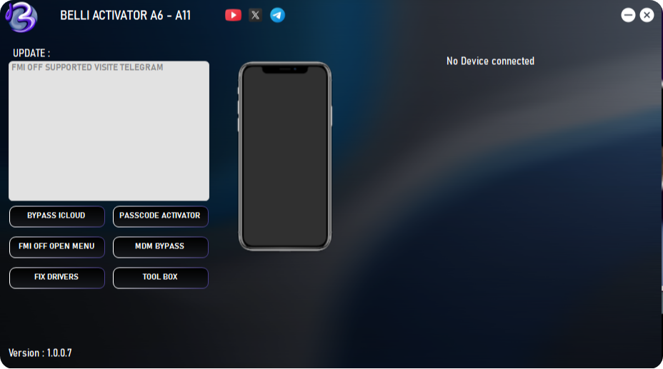
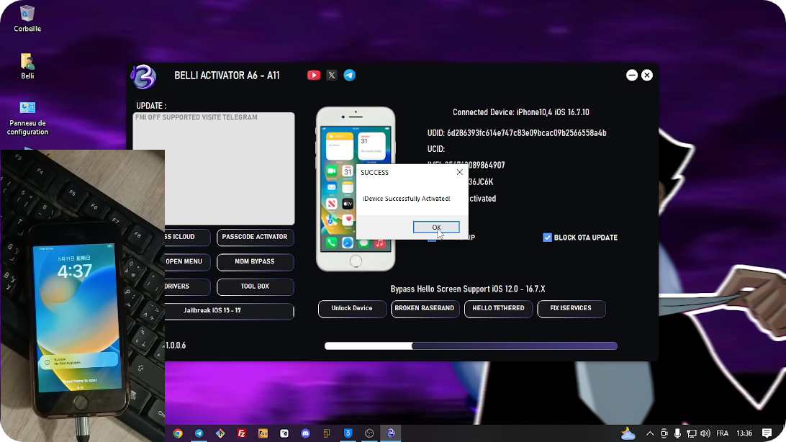
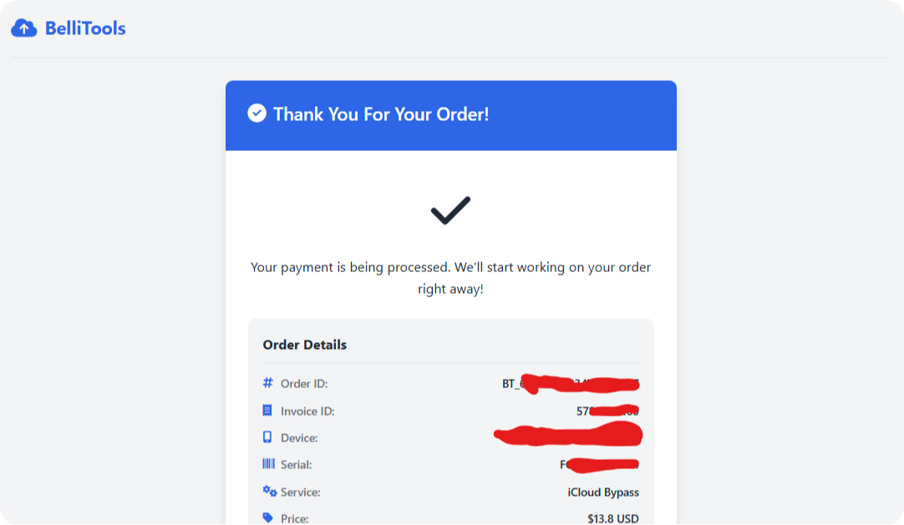

# 🔓 BELLI AIO UNLOCKER

**The Ultimate Tool for iCloud & MDM Bypass, FMI OFF, Passcode Removal, Jailbreak, and More**

---

  

---

### 📢 Telegram Channel 
 
- Telegram Channel: [https://t.me/BelliTools](https://t.me/BelliTools)
- Join Our Telegram Channel For Last Updates.  

---
## 🚀 Key Features

- ✅ MDM Bypass (iOS 12 - 18.x)  
- ✅ iCloud Bypass (iOS 12 - 16.x)  
- ✅ FMI OFF Open Menu (iOS 12 - 18.x)  
- ✅ Passcode Bypass (iOS 12 - 16.x)  
- ✅ Jailbreak (Checkm8 Devices) (iOS 12 - 16.x)  

---

## 📱 Supported Devices & Pricing

### iPhone Models & Prices

| Device              | Price (USD) |
|---------------------|-------------|
| iPhone X            | $19.60      |
| iPhone 8 / 8 Plus   | $15.70      |
| iPhone 7 / 7 Plus   | $13.80      |
| iPhone 6s / 6s Plus / SE (1st Gen) | $10.30 |

### Supported iPhone Models
- iPhone 6s / 6s Plus  
- iPhone SE (1st Gen)  
- iPhone 7 / 7 Plus  
- iPhone 8 / 8 Plus  
- iPhone X  

### Supported iPad Models 
- iPad Air 2 WiFi / 4G  
- iPad Mini 4 WiFi / 4G  
- iPad 5 (2017) WiFi / 4G  
- iPad 6 (2018) WiFi / 4G  
- iPad 7 (2019) WiFi / 4G  
- iPad Pro 10.5 WiFi / 4G  
- iPad Pro 12.9 (2nd Gen) WiFi / 4G  

---
### Supported Models (FMI OFF)
- ALL DEVICES iPhone and iPads

---

## 💰 FMI OFF Price
- $5 per device

---

## 📦 Download & Links
- 🔗 Direct Download: [MEGA Link](https://mega.nz/folder/2FBiWKLY#Wr6ZT63-6AxYi56be13Y_A)  
- 🌐 Official Website: [https://belliactivator.vercel.app](https://belliactivator.vercel.app)  
- 📺 YouTube Channel: [@BELLIDEV](https://www.youtube.com/@BELLIDEV)  
- 🐙 GitHub: [https://github.com/B9yn8](https://github.com/B9yn8)  
- 📞 Support Telegram: [@BELLIDEV0](https://t.me/BELLIDEV0)  
- 🤖 Payment Bot: [@newSignalBOBOT](https://t.me/newSignalBOBOT)  

---

## 🛠️ How to Use
1. Register on [payment portal](http://paymentsbellitools.x10.mx) or via Telegram bot
2. Download the tool from MEGA link
3. Put device in Hello screen mode
4. Run tool and select "Bypass" → "BYPASS ICLOUD"
5. Wait for process to complete
6. Device will restart automatically

**Important Notes:**
- Always select "BLOCK OTA UPDATE" and "SKIP SETUP" for best results
- Device must be in Hello screen mode

---

## 📷 Screenshots

  

  

---

## 📜 LEGAL NOTICE & DISCLAIMER
Welcome to this channel! Please read the following legal notice carefully before using or sharing any content from this channel.

---

### 🔐 Educational Purpose Only
All tools, software, methods, and guides shared in this channel are strictly for **educational and informational purposes**.  
We do **not** promote or encourage any illegal activity, unauthorized access, or use of stolen devices.  
This content is intended to help individuals who:  
- Have lost access to their own iCloud accounts or MDM profiles.  
- Are legally authorized to perform bypass or recovery on their own devices.  
- Want to learn about iOS security, development, and ethical testing for educational or research purposes.

---

### 🧾 Copyright Disclaimer – Fair Use Act Notice
> Copyright Disclaimer under Section 107 of the Copyright Act 1976  
> Allowance is made for "fair use" for purposes such as criticism, comment, news reporting, teaching, scholarship, and research.  
> Fair use is a use permitted by copyright statute that might otherwise be infringing.  
> Non-profit, educational or personal use tips the balance in favor of fair use.

All logos, trademarks, and brand names used in tools or media belong to their respective owners.  
We do **not** claim ownership of any iOS firmware, Apple services, or Apple branding.

---

### 📄 DMCA Compliance
Under the Digital Millennium Copyright Act (DMCA), jailbreaking or rooting a device for personal, non-commercial use is legal in many jurisdictions. This channel provides resources for legal modification of devices owned by the user or with proper consent.

We do **not** support bypassing for commercial exploitation or resale of stolen devices.  
Any user who misuses the information or tools provided is solely responsible for their actions.

---

### 📦 Commercial Tools & Cloud Services
Some services provided may include a paid component to cover server costs, licensing, cloud computing, or tool maintenance.  
These fees are **not for profit**, but necessary to maintain continuous service and support.  
We do **not** sell stolen or illegal content.

---

### ❌ Disclaimer of Liability
By using any of the information or tools shared here:
- You agree that your actions are your sole responsibility.  
- We are not responsible for any misuse, data loss, or legal issues caused by improper use.  
- This channel and its administrators are not liable for actions performed using shared tools or knowledge.

---

### 📢 Final Notes
This channel:  
- Does **not** promote piracy.  
- Does **not** distribute paid Apple content.  
- Does **not** bypass security for profit or resale.  
- Exists solely to educate and support users in legitimate recovery scenarios.

If you believe any content violates your rights, please contact us directly and we will respond in full cooperation under applicable laws.

---

© 2025 **BELLI AIO UNLOCKER – All Rights Reserved**  
For support: [@BELLIDEV0](https://t.me/BELLIDEV0)  
Telegram Channel: [https://t.me/BelliTools](https://t.me/BelliTools)
GitHub: [https://github.com/B9yn8](https://github.com/B9yn8)  
Website: [https://belliactivator.vercel.app](https://belliactivator.vercel.app)  
YouTube: [@BELLIDEV](https://www.youtube.com/@BELLIDEV)  
Payment Bot: [@newSignalBOBOT](https://t.me/newSignalBOBOT)
